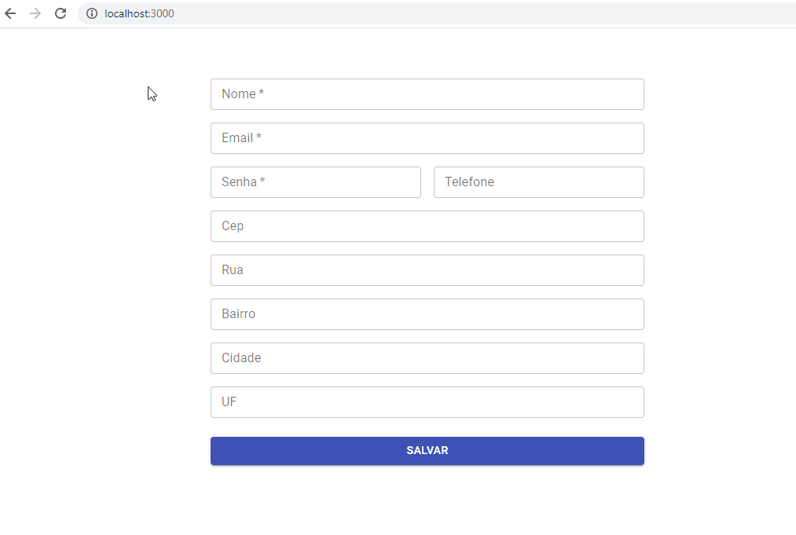

# Exemplo validação de formulário e endereço preenchido automaticamente ao informar o CEP.



## Bibliotecas usadas neste mini projeto:
-   Reduxsauce: https://www.npmjs.com/package/reduxsauce
-   Redux-Saga: https://redux-saga.js.org/
-   React Hook Form: https://react-hook-form.com/
-   MATERIAL-UI: https://material-ui.com/

E para o preenchimento automatico do endereço, foi utilizada a API da [ViaCEP] 

### Como baixar e executar a aplicação:

```
1. git clone https://github.com/Weisbergbsf/example-reduxsauce-redux-saga.git
2. cd example-reduxsauce-redux-saga
3. npm install 
4. npm start
```


[ViaCEP]: <https://viacep.com.br/>
